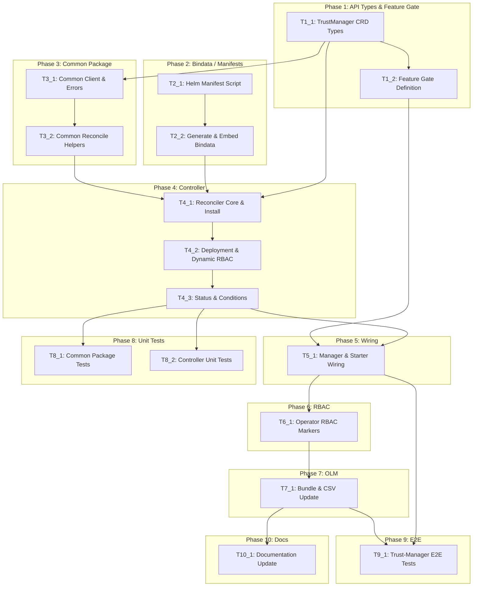

# Execution Backlog

**Feature:** CM-830 — Trust-Manager Integration as Operand in cert-manager-operator
**AgentRoutingMode:** PROVIDED
**ConstitutionVersion:** 1.0.0

## 0. Input coverage checklist

**Spec requirements → Task coverage:**
- FR-001 (enable trust-manager via operator API, feature gate + featureSet) → T1_1, T1_2, T5_1
- FR-002 (deploy and manage operand lifecycle) → T4_1, T4_2, T4_3
- FR-003 (reject when featureSet incompatible) → T1_1, T5_1, T9_1
- FR-004 (trust bundle sources: ConfigMap, inline) → T2_1 (operand capability, bindata)
- FR-005 (distribute as ConfigMap to label-selected namespaces) → T2_1 (operand capability)
- FR-006 (auto-create in new namespaces) → T2_1 (operand capability)
- FR-007 (propagate source updates) → T2_1 (operand capability)
- FR-008 (Secret-based targets, gated) → T1_1, T4_2
- FR-009 (dynamic RBAC scoped to config) → T4_2, T6_1
- FR-010 (operand health via status conditions) → T4_3
- FR-011 (per-bundle status) → T2_1 (operand capability)
- FR-012 (operational parameters: log, namespace, filtering) → T1_1, T4_2
- FR-013 (cleanup on CR deletion) → T4_1, T4_3
- FR-014 (no resources when feature gate disabled) → T5_1
- SC-001 (Ready within 120s) → T9_1
- SC-002 (bundle distributed within 60s) → T9_1
- SC-003 (source update propagation 60s) → T9_1
- SC-004 (invalid config surfaced in 30s) → T4_3, T9_1
- SC-005 (disable removes managed resources) → T4_1, T9_1
- SC-006 (secret targets scoped to N names) → T4_2, T9_1

**Plan phases → Task coverage:**
- Phase 1 (API Types & Feature Gate) → T1_1, T1_2
- Phase 2 (Bindata / Manifest Generation) → T2_1, T2_2
- Phase 3 (Common Package) → T3_1, T3_2
- Phase 4 (Controller Implementation) → T4_1, T4_2, T4_3
- Phase 5 (Operator Wiring) → T5_1
- Phase 6 (RBAC & Security) → T6_1
- Phase 7 (OLM Packaging) → T7_1
- Phase 8 (Unit Testing) → T8_1, T8_2
- Phase 9 (E2E Testing) → T9_1
- Phase 10 (Documentation) → T10_1

## 1. Task Dependency Graph (Mermaid)



## 2. Linear Execution Order (Chronological)

1. ~~T1_1 — TrustManager CRD Types~~ [x]
2. ~~T1_2 — Feature Gate Definition~~ [x]
3. T2_1 — Helm Manifest Script
4. T2_2 — Generate & Embed Bindata
5. T3_1 — Common Client & Errors
6. T3_2 — Common Reconcile Helpers
7. T4_1 — Reconciler Core & Install Sequence
8. T4_2 — Deployment Reconciler & Dynamic RBAC
9. T4_3 — Status Management & Conditions
10. T5_1 — Manager & Starter Wiring
11. T6_1 — Operator RBAC Markers & Generation
12. T7_1 — Bundle & CSV Update
13. T8_1 — Common Package Unit Tests
14. T8_2 — Controller Unit Tests
15. T9_1 — Trust-Manager E2E Tests
16. T10_1 — Documentation Update

## 3. Task Execution Manifest

| Task ID | Task Title | Assigned Agent | Phase | Depends On | Parallel OK | Complexity | Risk |
|---------|-----------|---------------|-------|-----------|------------|-----------|------|
| T1_1 | TrustManager CRD Types | API_Agent | Phase 1 | none | No | 5 | Med |
| T1_2 | Feature Gate Definition | API_Agent | Phase 1 | T1_1 | No | 2 | Low |
| T2_1 | Helm Manifest Script | ManifestsBindata_Agent | Phase 2 | none | Yes | 3 | Med |
| T2_2 | Generate & Embed Bindata | ManifestsBindata_Agent | Phase 2 | T2_1 | No | 3 | Low |
| T3_1 | Common Client & Errors | OperatorController_Agent | Phase 3 | T1_1 | No | 5 | High |
| T3_2 | Common Reconcile Helpers | OperatorController_Agent | Phase 3 | T3_1 | No | 3 | Med |
| T4_1 | Reconciler Core & Install Sequence | OperatorController_Agent | Phase 4 | T2_2, T3_2 | No | 8 | High |
| T4_2 | Deployment Reconciler & Dynamic RBAC | OperatorController_Agent | Phase 4 | T4_1 | No | 5 | High |
| T4_3 | Status Management & Conditions | OperatorController_Agent | Phase 4 | T4_2 | No | 3 | Low |
| T5_1 | Manager & Starter Wiring | OperatorController_Agent | Phase 5 | T4_3, T1_2 | No | 3 | Med |
| T6_1 | Operator RBAC Markers & Generation | RBACSecurity_Agent | Phase 6 | T5_1 | No | 2 | Low |
| T7_1 | Bundle & CSV Update | OLMRelease_Agent | Phase 7 | T6_1 | No | 3 | Med |
| T8_1 | Common Package Unit Tests | OperatorController_Agent | Phase 8 | T4_3 | Yes | 3 | Low |
| T8_2 | Controller Unit Tests | OperatorController_Agent | Phase 8 | T4_3 | Yes | 5 | Med |
| T9_1 | Trust-Manager E2E Tests | Testing_Agent | Phase 9 | T5_1, T7_1 | No | 5 | Med |
| T10_1 | Documentation Update | Docs_Agent | Phase 10 | T7_1 | Yes | 2 | Low |

## 4. Task Specifications (Payloads)

### Task T1_1: TrustManager CRD Types

- **Objective:** Define the `TrustManager` and `TrustManagerList` types in `api/operator/v1alpha1/` with full spec and status structs, kubebuilder markers, CEL validation, and scheme registration.
- **Target file(s):**
  - `api/operator/v1alpha1/trustmanager_types.go` (NEW)
  - `api/operator/v1alpha1/zz_generated.deepcopy.go` (REGENERATED)
  - `config/crd/bases/operator.openshift.io_trustmanagers.yaml` (GENERATED)
- **Non-goals / forbidden edits:**
  - Do NOT modify `certmanager_types.go` or `istiocsr_types.go`
  - Do NOT embed `operatorv1.OperatorSpec` (constitution Principle IX exception for addons)
  - Do NOT create webhooks (CEL handles validation)
  - Do NOT modify `groupversion_info.go` or `doc.go` (register via `init()` in types file)
- **Implementation notes:**
  - Follow `istiocsr_types.go` structure: `init()` → `SchemeBuilder.Register()`, markers for scope/singleton/printcolumns/categories
  - Cluster-scoped singleton: CEL `self.metadata.name == 'cluster'`
  - Spec struct: `TrustManagerSpec` with nested `TrustManagerConfig` (logLevel, logFormat, trustNamespace, filterExpiredCertificates, secretTargets)
  - SecretTargets: nested struct with `enabled` (Enabled/Disabled enum), `authorizedSecretsAll`, `authorizedSecrets []string`
  - Immutable field: `trustNamespace` — CEL `oldSelf == '' || self == oldSelf`
  - Status: embed `ConditionalStatus` from `meta.go` + `trustManagerImage`, `trustManagerVersion` observed fields
  - Use `+kubebuilder:validation:Enum` for typed string enums (Enabled/Disabled, text/json)
  - Use `+kubebuilder:default` for sensible defaults (logLevel: 1, logFormat: text, trustNamespace: cert-manager, filterExpiredCertificates: Disabled, secretTargets.enabled: Disabled)
  - `ControllerConfig` with labels/annotations maps only (no overrideArgs/Env — domain-specific config handles operand args)
- **Acceptance criteria:**
  - `go build ./api/...` passes
  - `make generate && make manifests` produces valid CRD YAML
  - CRD YAML contains CEL singleton rule, immutability rule, enum validation
  - `make verify` passes (deepcopy, CRD consistency)
  - Maps to: FR-001, FR-003, FR-008, FR-012
- **Downstream handoff:** Types available for controller import; CRD available for OLM bundle; deepcopy generated for runtime

### Task T1_2: Feature Gate Definition

- **Objective:** Register `FeatureTrustManager` feature gate as TechPreview (default: false) in `features.go`.
- **Target file(s):**
  - `api/operator/v1alpha1/features.go` (MODIFY)
- **Non-goals / forbidden edits:**
  - Do NOT modify the `FeatureIstioCSR` entry
  - Do NOT wire the feature gate into `starter.go` yet (that's T5_1)
- **Implementation notes:**
  - Add `FeatureTrustManager featuregate.Feature = "TrustManager"` variable
  - Add to `OperatorFeatureGates` map: `FeatureTrustManager: {Default: false, PreRelease: featuregate.Beta}` (TechPreview uses Beta per k8s featuregate convention)
  - Add comment with link to OpenShift enhancement (if available) matching IstioCSR pattern
- **Acceptance criteria:**
  - `go build ./api/...` passes
  - Feature gate is registered and defaults to disabled
  - Maps to: FR-001, FR-014
- **Downstream handoff:** Gate constant available for `starter.go` and `pkg/features/` wiring in T5_1

### Task T2_1: Helm Manifest Script

- **Objective:** Create `hack/update-trust-manager-manifests.sh` that generates static manifests from the upstream trust-manager helm chart, and add `TRUST_MANAGER_VERSION` to the Makefile.
- **Target file(s):**
  - `hack/update-trust-manager-manifests.sh` (NEW)
  - `Makefile` (MODIFY — add `TRUST_MANAGER_VERSION`, update `update-manifests` target)
- **Non-goals / forbidden edits:**
  - Do NOT modify existing `hack/update-cert-manager-manifests.sh` or `hack/update-istio-csr-manifests.sh`
  - Do NOT run the script (just create it; T2_2 runs it)
- **Implementation notes:**
  - Mirror `hack/update-istio-csr-manifests.sh` pattern: helm template → yq relabel (`app.kubernetes.io/managed-by: cert-manager-operator`) → yq split → move CRDs to `config/crd/bases/` → move resources to `bindata/trust-manager/resources/`
  - Remove helm.sh/chart labels, add `app: cert-manager-trust-manager` label
  - `TRUST_MANAGER_VERSION` — pin to latest stable (e.g. `v0.14.0` or current)
  - Add to Makefile `update-manifests` target: `hack/update-trust-manager-manifests.sh $(TRUST_MANAGER_VERSION)`
  - Add `RELATED_IMAGE_CERT_MANAGER_TRUSTMANAGER` and `TRUSTMANAGER_OPERAND_IMAGE_VERSION` env vars to Makefile local-run section
- **Acceptance criteria:**
  - Script is executable (`chmod +x`)
  - Script references correct helm chart (`cert-manager/trust-manager`)
  - Makefile target syntax valid
  - Maps to: FR-002 (deployment from manifests)
- **Downstream handoff:** Script ready for T2_2 to execute; Makefile version variable available

### Task T2_2: Generate & Embed Bindata

- **Objective:** Execute the manifest generation script and embed the resulting YAML files as go-bindata assets.
- **Target file(s):**
  - `bindata/trust-manager/resources/` (NEW — generated manifests)
  - `config/crd/bases/` (NEW — Bundle CRD from upstream)
- **Non-goals / forbidden edits:**
  - Do NOT hand-edit generated manifests (only the script controls content)
  - Do NOT modify existing bindata directories
- **Implementation notes:**
  - Run `hack/update-trust-manager-manifests.sh` with the pinned version
  - Run `make update-bindata` to regenerate go-bindata assets
  - Verify expected files exist: Deployment, ServiceAccount, ClusterRole, ClusterRoleBinding, Service, webhook resources
  - Verify Bundle CRD (`bundles.trust.cert-manager.io`) placed in `config/crd/bases/`
- **Acceptance criteria:**
  - `bindata/trust-manager/resources/` contains operand manifests
  - `config/crd/bases/` contains Bundle CRD
  - `make update-bindata` succeeds
  - `make verify` passes
  - Maps to: FR-002, FR-004–FR-007 (operand manifests enabling these capabilities)
- **Downstream handoff:** Bindata available for controller to decode and apply; CRD available for OLM bundle

### Task T3_1: Common Client & Errors

- **Objective:** Create `pkg/controller/common/` with shared SSA client wrapper (`CtrlClient`), error classification types, and constants.
- **Target file(s):**
  - `pkg/controller/common/client.go` (NEW)
  - `pkg/controller/common/errors.go` (NEW)
  - `pkg/controller/common/constants.go` (NEW)
- **Non-goals / forbidden edits:**
  - Do NOT modify `pkg/controller/istiocsr/` (IstioCSR migration is out of scope)
  - Do NOT add controller-runtime dependency beyond what's already in `go.mod`
- **Implementation notes:**
  - `CtrlClient` interface: `Get`, `List`, `Patch` (SSA: `client.Apply`, `client.FieldOwner`, `client.ForceOwnership`), `StatusUpdate`, `Exists`, `Delete`
  - `NewClient(mgr manager.Manager) CtrlClient` constructor
  - Error types from agents.md: `NewIrrecoverableError(msg)`, `NewRetryRequiredError(msg, cause)`, `FromClientError(err)` — classify 401/403/Invalid as irrecoverable
  - `ManagedResourceLabelKey = "app"` constant
  - `defaultRequeueTime = 30 * time.Second`
- **Acceptance criteria:**
  - `go build ./pkg/controller/common/...` passes
  - `go vet ./pkg/controller/common/...` passes
  - Client interface supports SSA apply pattern
  - Error types implement `error` interface with `IsIrrecoverable()` / `IsRetryRequired()` checks
  - Maps to: (foundation for FR-002, FR-009, FR-010)
- **Downstream handoff:** Client and error types importable by T3_2 and T4_1

### Task T3_2: Common Reconcile Helpers

- **Objective:** Create shared reconcile result handler, bindata decode helpers, and validation utilities in `pkg/controller/common/`.
- **Target file(s):**
  - `pkg/controller/common/reconcile_result.go` (NEW)
  - `pkg/controller/common/utils.go` (NEW)
  - `pkg/controller/common/validation.go` (NEW)
  - `pkg/controller/common/fakes/fake_ctrl_client.go` (NEW)
- **Non-goals / forbidden edits:**
  - Do NOT implement controller-specific logic (keep generic)
  - Do NOT generate counterfeiter fakes at this stage (placeholder interface file)
- **Implementation notes:**
  - `HandleReconcileResult(ctx, client, cr, conditions, err)` — updates status conditions based on error type (irrecoverable → Degraded, retryable → Progressing, nil → Ready)
  - `DecodeObjBytes[T runtime.Object](codecs, gv, bytes) (T, error)` — generic bindata YAML decoder
  - `UpdateName(obj, name)`, `UpdateNamespace(obj, ns)`, `UpdateResourceLabels(obj, labels)` — metadata setters
  - `ValidateLabelsConfig`, `ValidateAnnotationsConfig` — reusable validation from agents.md
  - `fakes/fake_ctrl_client.go` — counterfeiter interface file for test mocking
- **Acceptance criteria:**
  - `go build ./pkg/controller/common/...` passes
  - Reconcile result handler correctly maps error types to condition states
  - Maps to: (foundation for FR-010, FR-013)
- **Downstream handoff:** All helpers available for controller implementation in T4_1

### Task T4_1: Reconciler Core & Install Sequence

- **Objective:** Create the trust-manager controller package with the main reconciler, install sequence, constants, and resource reconcilers (ServiceAccount, Services, basic RBAC).
- **Target file(s):**
  - `pkg/controller/trustmanager/controller.go` (NEW)
  - `pkg/controller/trustmanager/install_trustmanager.go` (NEW)
  - `pkg/controller/trustmanager/constants.go` (NEW)
  - `pkg/controller/trustmanager/serviceaccounts.go` (NEW)
  - `pkg/controller/trustmanager/services.go` (NEW)
  - `pkg/controller/trustmanager/utils.go` (NEW)
- **Non-goals / forbidden edits:**
  - Do NOT implement deployment reconciler or dynamic RBAC (those are T4_2)
  - Do NOT wire into `setup_manager.go` (that's T5_1)
  - Do NOT implement full cleanup logic (warning event only per agents.md for TechPreview)
- **Implementation notes:**
  - `controller.go`: `Reconciler` struct embedding `common.CtrlClient`, `New(mgr)`, `SetupWithManager()` with watches (TrustManager CR + managed resources via label selector `app=cert-manager-trust-manager`)
  - Finalizer: `trustmanager.openshift.operator.io/cert-manager-trust-manager-controller`
  - `install_trustmanager.go`: ordered sequence — validateConfig → serviceAccounts → RBAC (basic) → services → deployment → webhooks → updateStatusObservedState
  - `constants.go`: `ControllerName`, `RequestEnqueueLabelValue = "cert-manager-trust-manager"`, `RELATED_IMAGE_CERT_MANAGER_TRUSTMANAGER`, `TRUSTMANAGER_OPERAND_IMAGE_VERSION`, asset name constants, `fieldOwner = "trust-manager-controller"`
  - `utils.go`: local scheme/codecs, `updateStatus()` with retry, `addFinalizer()`/`removeFinalizer()`, `validateConfig()`
  - SSA apply pattern: decode bindata → set metadata → `r.Patch(ctx, desired, client.Apply, client.FieldOwner(fieldOwner), client.ForceOwnership)`
- **Acceptance criteria:**
  - `go build ./pkg/controller/trustmanager/...` passes
  - Reconciler compiles with correct interface (implements `reconcile.Reconciler`)
  - Install sequence is complete and ordered
  - Maps to: FR-002, FR-013, SC-005
- **Downstream handoff:** Reconciler skeleton ready for deployment/RBAC additions in T4_2; compilable package for T5_1 wiring

### Task T4_2: Deployment Reconciler & Dynamic RBAC

- **Objective:** Implement the deployment reconciler (trust-manager operand Deployment with args from CR spec) and dynamic RBAC logic (secret targets permission scoping).
- **Target file(s):**
  - `pkg/controller/trustmanager/deployments.go` (NEW)
  - `pkg/controller/trustmanager/rbacs.go` (NEW)
  - `pkg/controller/trustmanager/webhooks.go` (NEW)
- **Non-goals / forbidden edits:**
  - Do NOT modify bindata manifests (reconciler reads and patches them at runtime)
  - Do NOT grant cluster-admin or overly broad permissions
- **Implementation notes:**
  - `deployments.go`: Decode deployment from bindata, set image from `RELATED_IMAGE_CERT_MANAGER_TRUSTMANAGER`, inject args based on CR spec (`--log-level`, `--log-format`, `--trust-namespace`, `--filter-expired-certificates`), set resource labels from CR controllerConfig
  - `rbacs.go`: Apply base ClusterRole/Binding from bindata. When `secretTargets.enabled`:
    - If `authorizedSecretsAll=Enabled`: apply ClusterRole with full secrets verbs
    - If `authorizedSecrets` list provided: apply ClusterRole with ResourceNames scoping
    - If secretTargets disabled: apply base ClusterRole without secret write access
  - `webhooks.go`: Apply webhook Deployment + Service + cert-manager Certificate for trust-manager webhook TLS (cert-manager issues the serving cert)
  - Dynamic RBAC cleanup: on CR spec change from enabled→disabled, remove dynamic ClusterRole
- **Acceptance criteria:**
  - `go build ./pkg/controller/trustmanager/...` passes
  - Deployment args correctly derived from spec fields
  - RBAC varies correctly based on secretTargets configuration
  - Maps to: FR-008, FR-009, FR-012, SC-006
- **Downstream handoff:** Complete operand deployment logic; status fields populated for T4_3

### Task T4_3: Status Management & Conditions

- **Objective:** Implement status condition management (`Ready`/`Degraded`) and observed state reporting on the TrustManager CR.
- **Target file(s):**
  - `pkg/controller/trustmanager/controller.go` (MODIFY — integrate HandleReconcileResult)
  - `pkg/controller/trustmanager/install_trustmanager.go` (MODIFY — add updateStatusObservedState call)
- **Non-goals / forbidden edits:**
  - Do NOT add new condition types beyond Ready/Degraded
- **Implementation notes:**
  - After install sequence completes: set `Ready=True`, record observed image and version in status
  - On irrecoverable error: set `Degraded=True` with message, `Ready=False`
  - On retryable error: set `Ready=False`, `Degraded=False` (progressing state)
  - `updateStatusObservedState()`: read deployed Deployment image → set `status.trustManagerImage`, extract version label → set `status.trustManagerVersion`
  - Use `common.HandleReconcileResult()` as the condition state machine
- **Acceptance criteria:**
  - `go build ./pkg/controller/trustmanager/...` passes
  - Status transitions are deterministic (per error classification)
  - Maps to: FR-003, FR-010, SC-001, SC-004
- **Downstream handoff:** Complete controller ready for wiring in T5_1

### Task T5_1: Manager & Starter Wiring

- **Objective:** Wire the trust-manager controller into the unified manager in `setup_manager.go` and add TechPreview feature gate check in `starter.go` using cluster FeatureSet discovery.
- **Target file(s):**
  - `pkg/operator/setup_manager.go` (MODIFY)
  - `pkg/operator/starter.go` (MODIFY)
  - `pkg/features/features.go` (MODIFY — add TechPreview gating with cluster FeatureSet)
- **Non-goals / forbidden edits:**
  - Do NOT create a separate `ctrl.Manager` (register on existing manager)
  - Do NOT modify IstioCSR wiring or feature gate behavior
- **Implementation notes:**
  - `setup_manager.go`: Import trustmanager package, add `trustManagerManagedResources` slice, add TrustManager CR to cache config, call `setupTrustManagerController(mgr)` within `NewControllerManager()`
  - `starter.go`: Add TechPreview feature gate check — use `featureStatus.IsTrustManagerFeatureGateEnabled()` pattern (requires BOTH operator gate AND cluster FeatureSet)
  - `pkg/features/features.go`: Add `IsTrustManagerFeatureGateEnabled()` function using `passesClusterPreviewGating()` (existing TechPreview discovery logic with 3x retry, 30s backoff, fails closed)
  - Register TrustManager scheme types in `setup_manager.go init()`
- **Acceptance criteria:**
  - `go build ./...` passes
  - Trust-manager controller starts only when both gates pass
  - Trust-manager controller does NOT start when feature gate disabled
  - `make test` passes (no regression to IstioCSR)
  - Maps to: FR-001, FR-003, FR-014
- **Downstream handoff:** Operator binary includes trust-manager controller; ready for RBAC generation in T6_1

### Task T6_1: Operator RBAC Markers & Generation

- **Objective:** Add kubebuilder RBAC markers to the trust-manager reconciler and regenerate `config/rbac/role.yaml`.
- **Target file(s):**
  - `pkg/controller/trustmanager/controller.go` (MODIFY — add markers)
  - `config/rbac/role.yaml` (REGENERATED)
- **Non-goals / forbidden edits:**
  - Do NOT manually edit `config/rbac/role.yaml` (it's generated)
  - Do NOT modify IstioCSR RBAC markers
- **Implementation notes:**
  - Add `+kubebuilder:rbac` markers for: trustmanagers (get/list/watch/patch/update), trustmanagers/status (get/patch/update), trustmanagers/finalizers (update), apps/deployments, core/services/serviceaccounts/configmaps/secrets (metadata), rbac/clusterroles/clusterrolebindings/roles/rolebindings, networking/networkpolicies, cert-manager certificates
  - Run `make manifests` to regenerate role.yaml
  - Verify no unintended permission removals for existing controllers
- **Acceptance criteria:**
  - `make manifests && make verify` passes
  - `config/rbac/role.yaml` contains trust-manager GVK permissions
  - No regression to existing IstioCSR/CertManager RBAC
  - Maps to: FR-009 (operator has permission to manage dynamic operand RBAC)
- **Downstream handoff:** RBAC complete for OLM bundle in T7_1

### Task T7_1: Bundle & CSV Update

- **Objective:** Update the OLM bundle with the TrustManager CRD, environment variables, relatedImages, and sample CR.
- **Target file(s):**
  - `bundle/manifests/cert-manager-operator.clusterserviceversion.yaml` (REGENERATED)
  - `bundle/manifests/operator.openshift.io_trustmanagers.yaml` (NEW — CRD in bundle)
  - `config/samples/tech-preview/operator_v1alpha1_trustmanager.yaml` (NEW)
  - `Makefile` (VERIFY — RELATED_IMAGE vars present from T2_1)
- **Non-goals / forbidden edits:**
  - Do NOT modify bundle metadata (channels, annotations) unless required
  - Do NOT add Bundle CRD to CSV owned list (it's an operand CRD, not operator-owned)
- **Implementation notes:**
  - Add `trustmanagers.operator.openshift.io` to CSV `spec.customresourcedefinitions.owned`
  - Add `RELATED_IMAGE_CERT_MANAGER_TRUSTMANAGER` and `TRUSTMANAGER_OPERAND_IMAGE_VERSION` to CSV deployment env
  - Add trust-manager image to `spec.relatedImages`
  - Create sample CR: minimal TrustManager with name `cluster`, default settings
  - Run `make bundle`
- **Acceptance criteria:**
  - `make bundle && hack/verify-bundle.sh` passes
  - CSV contains TrustManager CRD in owned list
  - CSV contains RELATED_IMAGE env var
  - Sample CR is valid against generated CRD schema
  - Maps to: FR-001 (installable via OLM)
- **Downstream handoff:** Operator installable via OLM with trust-manager support; ready for E2E

### Task T8_1: Common Package Unit Tests

- **Objective:** Write unit tests for `pkg/controller/common/` covering client operations, error classification, and reconcile result handling.
- **Target file(s):**
  - `pkg/controller/common/client_test.go` (NEW)
  - `pkg/controller/common/errors_test.go` (NEW)
  - `pkg/controller/common/reconcile_result_test.go` (NEW)
- **Non-goals / forbidden edits:**
  - Do NOT test controller-specific logic here (only common utilities)
- **Implementation notes:**
  - Table-driven tests for error classification (`FromClientError` with various k8s error types)
  - Test `HandleReconcileResult` state machine: nil error → Ready, irrecoverable → Degraded, retryable → Progressing
  - Use envtest or fake client for SSA apply tests
  - Follow existing test patterns: `testing` + `testify/assert` + `testify/require`
- **Acceptance criteria:**
  - `go test ./pkg/controller/common/...` passes
  - Coverage of error classification and result handler state transitions
  - Maps to: (quality gate — supports FR-010 status correctness)
- **Downstream handoff:** Common package validated; controller tests in T8_2 can use fakes

### Task T8_2: Controller Unit Tests

- **Objective:** Write unit tests for the trust-manager controller covering install sequence, deployment arg injection, dynamic RBAC, status updates, and config validation.
- **Target file(s):**
  - `pkg/controller/trustmanager/controller_test.go` (NEW)
  - `pkg/controller/trustmanager/deployments_test.go` (NEW)
  - `pkg/controller/trustmanager/rbacs_test.go` (NEW)
  - `pkg/controller/trustmanager/install_trustmanager_test.go` (NEW)
  - `pkg/controller/trustmanager/test_utils.go` (NEW)
  - `pkg/controller/trustmanager/fakes/fake_ctrl_client.go` (NEW — counterfeiter)
- **Non-goals / forbidden edits:**
  - Do NOT require a running cluster (use fakes/mocks)
- **Implementation notes:**
  - Mirror `pkg/controller/istiocsr/*_test.go` patterns: counterfeiter fakes, table-driven, test both create and update paths
  - Test deployment args: verify each CR spec field maps to correct deployment arg
  - Test dynamic RBAC: verify ClusterRole rules change based on secretTargets config
  - Test config validation: verify invalid configs produce IrrecoverableError
  - Test status: verify condition transitions match error types
  - `test_utils.go`: helper to create test TrustManager CR with configurable fields
- **Acceptance criteria:**
  - `make test` passes (includes new tests)
  - All reconciler paths covered (happy path + error paths)
  - Maps to: FR-002–FR-014 (unit-level verification)
- **Downstream handoff:** Controller validated at unit level; ready for integration/e2e in T9_1

### Task T9_1: Trust-Manager E2E Tests

- **Objective:** Write end-to-end tests validating the trust-manager operand lifecycle on a live cluster: feature gate, CR creation, operand health, bundle distribution, secret targets, cleanup.
- **Target file(s):**
  - `test/e2e/trust_manager_test.go` (NEW)
  - `test/e2e/testdata/trust-manager/` (NEW — test fixtures: TrustManager CR templates, Bundle CR templates)
- **Non-goals / forbidden edits:**
  - Do NOT modify existing e2e tests or `suite_test.go` (unless adding client setup)
  - Do NOT test trust-manager operand internals (only operator-managed lifecycle)
- **Implementation notes:**
  - Build tag: `//go:build e2e`
  - Label: `Label("Feature:TrustManager")`
  - `Ordered` spec (lifecycle tests depend on sequence)
  - Test scenarios:
    1. With feature gate enabled + correct FeatureSet: create TrustManager CR → verify operand Deployment Ready within 120s (SC-001)
    2. Create Bundle CR → verify ConfigMap distributed to labeled namespace (SC-002)
    3. Update source ConfigMap → verify propagation (SC-003)
    4. Invalid config → verify Degraded condition (SC-004)
    5. Delete TrustManager CR → verify operand resources removed (SC-005)
    6. Secret targets: enable → verify scoped RBAC created (SC-006)
  - Use `pollTillTrustManagerAvailable()` helper (mirror `pollTillIstioCSRAvailable()` pattern)
  - Fixtures: TrustManager CR template, Bundle CR template, source ConfigMap
- **Acceptance criteria:**
  - `E2E_GINKGO_LABEL_FILTER="Feature:TrustManager" make test-e2e` passes on cluster with TechPreview enabled
  - All 6 success criteria validated end-to-end
  - Maps to: SC-001–SC-006
- **Downstream handoff:** Feature fully validated; ready for documentation and release

### Task T10_1: Documentation Update

- **Objective:** Update README.md with trust-manager section and create a user guide documenting enablement, configuration, and usage.
- **Target file(s):**
  - `README.md` (MODIFY — add trust-manager section)
  - `docs/trust-manager.md` (NEW)
- **Non-goals / forbidden edits:**
  - Do NOT document internal implementation details
  - Do NOT modify existing cert-manager or istio-csr documentation sections
- **Implementation notes:**
  - README: Add "Trust-Manager (Tech Preview)" section under existing operands, document feature gate enablement (`--unsupported-addon-features TrustManager=true`), link to user guide
  - User guide: prerequisites (FeatureSet), creating TrustManager CR, verifying operand health, creating Bundle CRs, configuring secret targets, troubleshooting (status conditions)
  - Include sample CRs (reference `config/samples/tech-preview/`)
- **Acceptance criteria:**
  - Documentation is technically accurate per implementation
  - No broken links
  - Maps to: (user-facing enablement of FR-001–FR-012)
- **Downstream handoff:** Feature documented and ready for release

## 5. Orchestration notes (non-code)

### Retry Boundaries

- **T1_1 (API types):** Safe to retry — only adds new files; regeneration is idempotent (`make generate && make manifests`)
- **T2_1/T2_2 (Bindata):** Safe to retry — script is idempotent (deletes output before regenerating)
- **T3_1/T3_2 (Common):** Safe to retry — new package, no side effects
- **T4_1–T4_3 (Controller):** Safe to retry individually — each task adds/modifies specific files
- **T5_1 (Wiring):** Retry with caution — modifies shared files (`setup_manager.go`, `starter.go`); verify IstioCSR still works after retry
- **T6_1 (RBAC):** Safe to retry — `make manifests` is idempotent
- **T7_1 (OLM):** Safe to retry — `make bundle` is idempotent

### Merge Conflict Hotspots

| File | Risk | Mitigation |
|------|------|------------|
| `pkg/operator/setup_manager.go` | Shared by all addon controllers | Make minimal, surgical additions near `// +kubebuilder:scaffold:builder` |
| `pkg/operator/starter.go` | Shared startup logic | Add trust-manager block after IstioCSR block, mirror structure exactly |
| `api/operator/v1alpha1/features.go` | All feature gates in one file | Append only — do not reorder existing entries |
| `config/rbac/role.yaml` | Generated, all controllers contribute | Never hand-edit; regenerate via `make manifests` |
| `Makefile` | Frequently modified | Add variables in sorted order near existing version vars |
| `zz_generated.deepcopy.go` | Regenerated on any type change | Always regenerate (`make generate`), never hand-edit |
| `bundle/manifests/*.yaml` | Regenerated on bundle changes | Always regenerate (`make bundle`), never hand-edit |

### Open Questions Requiring SME Before Execution

| Question | Blocks | Default if no answer |
|----------|--------|---------------------|
| defaultCAs exposure in TrustManager CR spec | T1_1 (field design) | Omit field — not exposed; available via unsupportedConfigOverrides |
| Trust-manager operand namespace (`cert-manager` vs separate) | T4_1 (deployment namespace) | Deploy in `cert-manager` (matches IstioCSR pattern) |
| Bundle CRD installation mechanism (bindata vs OLM) | T2_2 (CRD placement), T7_1 (CSV) | Operator installs from bindata (controller applies CRD during install sequence) |
| Network policies for trust-manager | T4_1 (install sequence) | Include NPs following cert-manager/istio-csr pattern (default deny + allow) |
| `pkg/controller/common/` scope | T3_1 (package design) | Minimum viable for trust-manager; document extension points for future |

```json
[
  {"id": "T1_1", "title": "TrustManager CRD Types", "summary": "Define TrustManager and TrustManagerList types with full spec, status, kubebuilder markers, and CEL validation", "phase": "Phase 1: API Types & Feature Gate", "depends_on": [], "agent": "API_Agent", "parallel_ok": false, "complexity": 5, "risk": "Med"},
  {"id": "T1_2", "title": "Feature Gate Definition", "summary": "Register FeatureTrustManager as TechPreview gate in features.go", "phase": "Phase 1: API Types & Feature Gate", "depends_on": ["T1_1"], "agent": "API_Agent", "parallel_ok": false, "complexity": 2, "risk": "Low"},
  {"id": "T2_1", "title": "Helm Manifest Script", "summary": "Create hack/update-trust-manager-manifests.sh and add TRUST_MANAGER_VERSION to Makefile", "phase": "Phase 2: Bindata / Manifests", "depends_on": [], "agent": "ManifestsBindata_Agent", "parallel_ok": true, "complexity": 3, "risk": "Med"},
  {"id": "T2_2", "title": "Generate & Embed Bindata", "summary": "Execute manifest script and embed YAML as go-bindata assets", "phase": "Phase 2: Bindata / Manifests", "depends_on": ["T2_1"], "agent": "ManifestsBindata_Agent", "parallel_ok": false, "complexity": 3, "risk": "Low"},
  {"id": "T3_1", "title": "Common Client & Errors", "summary": "Create pkg/controller/common/ with SSA client wrapper and error classification types", "phase": "Phase 3: Common Package", "depends_on": ["T1_1"], "agent": "OperatorController_Agent", "parallel_ok": false, "complexity": 5, "risk": "High"},
  {"id": "T3_2", "title": "Common Reconcile Helpers", "summary": "Create reconcile result handler, bindata decode helpers, and validation utilities", "phase": "Phase 3: Common Package", "depends_on": ["T3_1"], "agent": "OperatorController_Agent", "parallel_ok": false, "complexity": 3, "risk": "Med"},
  {"id": "T4_1", "title": "Reconciler Core & Install Sequence", "summary": "Create trust-manager controller with reconciler, install sequence, SA and service reconcilers", "phase": "Phase 4: Controller", "depends_on": ["T2_2", "T3_2"], "agent": "OperatorController_Agent", "parallel_ok": false, "complexity": 8, "risk": "High"},
  {"id": "T4_2", "title": "Deployment Reconciler & Dynamic RBAC", "summary": "Implement deployment arg injection from CR spec and dynamic RBAC for secret targets", "phase": "Phase 4: Controller", "depends_on": ["T4_1"], "agent": "OperatorController_Agent", "parallel_ok": false, "complexity": 5, "risk": "High"},
  {"id": "T4_3", "title": "Status Management & Conditions", "summary": "Implement Ready/Degraded condition management and observed state reporting", "phase": "Phase 4: Controller", "depends_on": ["T4_2"], "agent": "OperatorController_Agent", "parallel_ok": false, "complexity": 3, "risk": "Low"},
  {"id": "T5_1", "title": "Manager & Starter Wiring", "summary": "Wire trust-manager controller into unified manager and add TechPreview feature gate check", "phase": "Phase 5: Wiring", "depends_on": ["T4_3", "T1_2"], "agent": "OperatorController_Agent", "parallel_ok": false, "complexity": 3, "risk": "Med"},
  {"id": "T6_1", "title": "Operator RBAC Markers & Generation", "summary": "Add kubebuilder RBAC markers to reconciler and regenerate config/rbac/role.yaml", "phase": "Phase 6: RBAC", "depends_on": ["T5_1"], "agent": "RBACSecurity_Agent", "parallel_ok": false, "complexity": 2, "risk": "Low"},
  {"id": "T7_1", "title": "Bundle & CSV Update", "summary": "Update OLM bundle with TrustManager CRD, env vars, relatedImages, and sample CR", "phase": "Phase 7: OLM", "depends_on": ["T6_1"], "agent": "OLMRelease_Agent", "parallel_ok": false, "complexity": 3, "risk": "Med"},
  {"id": "T8_1", "title": "Common Package Unit Tests", "summary": "Unit tests for common client, error classification, and reconcile result handler", "phase": "Phase 8: Unit Tests", "depends_on": ["T4_3"], "agent": "OperatorController_Agent", "parallel_ok": true, "complexity": 3, "risk": "Low"},
  {"id": "T8_2", "title": "Controller Unit Tests", "summary": "Unit tests for trust-manager controller covering install, deployment, RBAC, and status", "phase": "Phase 8: Unit Tests", "depends_on": ["T4_3"], "agent": "OperatorController_Agent", "parallel_ok": true, "complexity": 5, "risk": "Med"},
  {"id": "T9_1", "title": "Trust-Manager E2E Tests", "summary": "End-to-end tests validating full operand lifecycle on live cluster", "phase": "Phase 9: E2E", "depends_on": ["T5_1", "T7_1"], "agent": "Testing_Agent", "parallel_ok": false, "complexity": 5, "risk": "Med"},
  {"id": "T10_1", "title": "Documentation Update", "summary": "Update README and create user guide for trust-manager enablement and configuration", "phase": "Phase 10: Docs", "depends_on": ["T7_1"], "agent": "Docs_Agent", "parallel_ok": true, "complexity": 2, "risk": "Low"}
]
```
